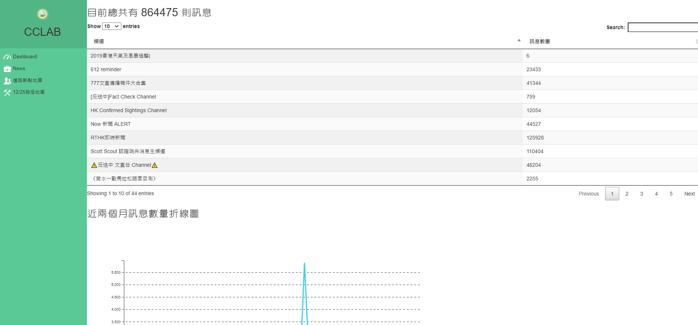
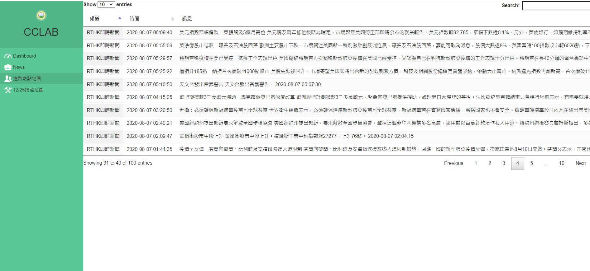
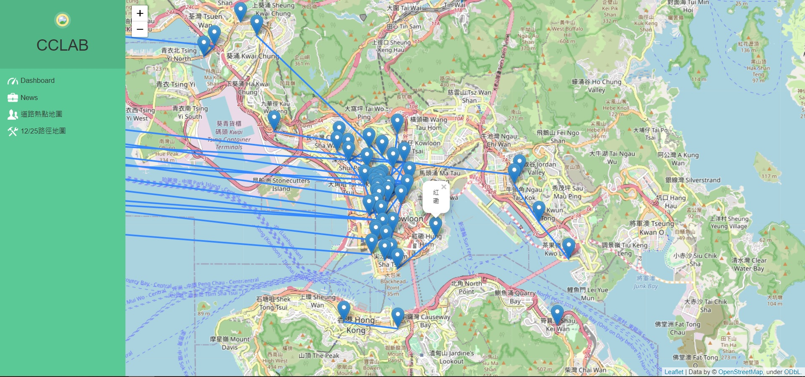
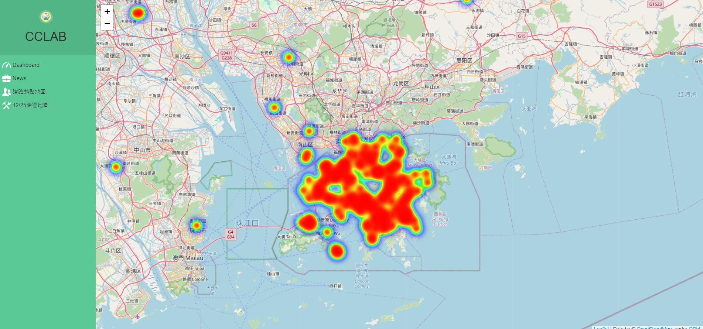

# Telegram Crawler Dashboard For HK Anti-ELAB Movement

===

## Description

Crawl data from telegram and using NLP methods to parse them.Then visualize data using Flask, D3.js.

## Framework

Flask
Python

Database:SQLite

## Demo

